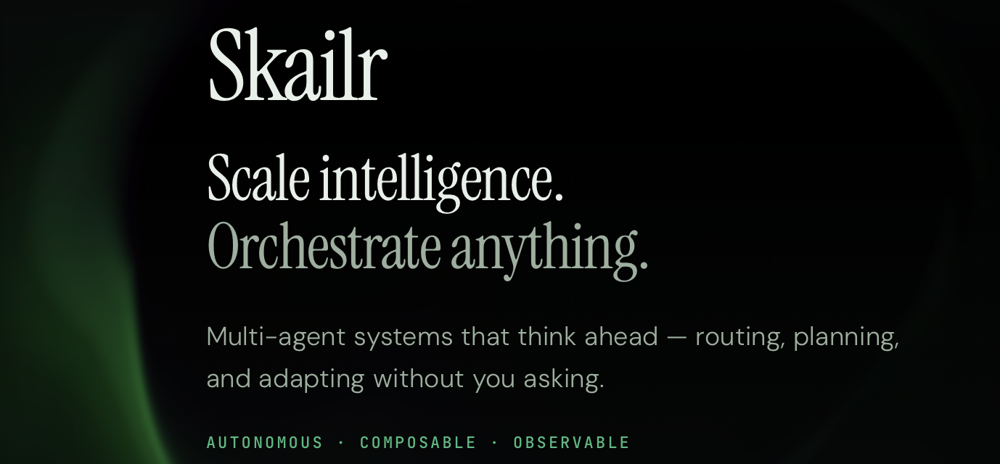

# skailr-agents

[](LICENSE)
[](https://docs.anthropic.com/en/docs/claude-code)
[](https://cursor.com/docs)
[](https://github.com/cursoragent)



**A multi-agent operating model for Claude Code and Cursor.** Install it into a repo; Claude Code (or Cursor) runs the agents. Skailr adds org structure: plan before build, single-job roles, a visible message board, frozen contracts, and mechanical script gates.

skailr-agents comes out of [Smith | Advanced Systems](https://advsys.io) (advsys.io), the research and development lab behind the project. For more info, see [skailr.io](https://skailr.io).

You do not need prior knowledge of skailr. Install once. **Plain chat is auto-routed** ([docs/INTAKE.md](docs/INTAKE.md)); or run a slash command explicitly.

| You want to… | Use | Commands |
| ------------ | --- | -------- |
| **Ask a question** (no code change) | Intake → expert (exact-one band) or researcher | Plain chat; Task `expert` advise or `researcher` ask mode |
| **Map an existing repo** (brownfield baseline, backlog) | Map-repo | `/map-repo` — [docs/MAP_REPO.md](docs/MAP_REPO.md) — or plain chat |
| **Small fix / tweak** (keep lineage/docs true) | Patch (YOLO-style) | `/patch` — or plain chat |
| **Build a whole app / MVP / many parts / unclear scope** (gated) | Program tier | `/discover` → `/plan-program` → `/build-program` |
| **Build a whole app** as fast as possible (no gates) | Program YOLO | `/yolo-program` — [docs/YOLO.md](docs/YOLO.md) |
| Ship **one** cohesive feature (with approval gates) | Workstream | `/ship-feature` → `/continue-feature` → `/build-feature` |
| Ship **one** feature as fast as possible (no gates) | Feature YOLO | `/yolo` — [docs/YOLO.md](docs/YOLO.md) |
| Run **many** concurrent initiatives | Portfolio | `/discover-portfolio` → `/plan-portfolio` → `/status-portfolio` |
| **Give the agents depth in your domain** (a project-local expert roster) | Experts | `/mint-expert`. Guide: [docs/experts.md](docs/experts.md) |
| **Write to or read from Intair** (a graph an agent or operator calls on purpose, in a given step) | Intair client seam | Reference guide: [docs/intair-seam.md](docs/intair-seam.md) |

**Important:** `/ship-feature` and `/yolo` are **one feature, one story, one build**. They will **not** break a whole product into workstreams. For a greenfield app or multi-part initiative, use **`/discover`…`/build-program`** or **`/yolo-program`**. On an unfamiliar existing codebase, run **`/map-repo`** first ([docs/MAP_REPO.md](docs/MAP_REPO.md)). Plain chat follows the same rules via intake ([docs/INTAKE.md](docs/INTAKE.md)).

---

## Quick start

### 0. What you need

- A project directory (empty git repo is fine; skailr does not scaffold your stack)
- [Claude Code](https://docs.anthropic.com/en/docs/claude-code) CLI (`claude` on your PATH), **or** [Cursor](https://cursor.com/docs)
- Node.js 18+ only if you want the mechanical gates (`scripts/skailr/*.mjs`) — optional for first runs

### 1. Create or open a project

```bash
mkdir my-app && cd my-app
git init
# optional: scaffold your stack (npm create, cargo init, etc.)
```

### 2. Install Claude Code (skip if you already have it)

```bash
curl -fsSL https://claude.ai/install.sh | bash
# or: npm install -g @anthropic-ai/claude-code
```

Log in on first run when prompted.

### 3. Install skailr-agents into the project

```bash
git clone https://github.com/ns-3e/skailr-agents.git /tmp/skailr-agents
/tmp/skailr-agents/install.sh "$(pwd)" --claude-only
```

Or from a local clone of this repo:

```bash
./install.sh /path/to/my-app --claude-only
```

Windows (PowerShell):

```powershell
git clone https://github.com/ns-3e/skailr-agents.git $env:TEMP\skailr-agents
& "$env:TEMP\skailr-agents\install.ps1" -TargetPath (Get-Location) -ClaudeOnly
```

Commit the pack so teammates get the same agents:

```bash
git add .claude CLAUDE.md scripts/skailr .gitignore
git commit -m "Add skailr-agents operating model"
```

After `/map-repo` confirms a baseline, also commit `.claude/repo/` (orientation, ownership draft, backlog) so the map is shared.

Omit `--claude-only` to also install the Cursor mirror; use `--cursor-only` for Cursor alone. More: [Install details](#install-details).

### 4. Start Claude Code in the project

```bash
cd /path/to/my-app
claude
```

Slash commands from the pack are available (`/map-repo`, `/discover`, `/yolo-program`, `/ship-feature`, `/yolo`, `/patch`, …). Plain chat is routed by `CLAUDE.md` ([docs/INTAKE.md](docs/INTAKE.md)).

---

### Path: Existing repo (brownfield)

Install into a non-empty project, then baseline before shipping:

```
/map-repo
```

Optional focus: `/map-repo auth and public UI`.

Claude maps the tree, drafts ownership, assesses gaps, and presents a backlog. **Confirm** the baseline (human gate). Then pick a backlog item → `/patch` / `/yolo`, or charter a larger initiative → `/discover` / `/yolo-program`. Full notes: [docs/MAP_REPO.md](docs/MAP_REPO.md).

| Command | What it does | Business equivalent |
| ------- | ------------ | ------------------- |
| `/map-repo` | Orientation, draft ownership, findings, backlog; confirm before build | **Brownfield onboarding / tech lead repo audit** |

---

### Path A — Whole app / many parts / unclear scope (program tier)

Use this for a greenfield product, an MVP with several subsystems, or anything too big for one story.

#### Path A1 — Gated (recommended when product decisions matter)

**Step 1 — Discover (shared understanding)**

Paste the product vision:

```
/discover I want a billing SaaS: orgs, invoices, email reminders 3 days before due,
customer portal to pay, and an admin dashboard. Stack preference: TypeScript.
```

Claude runs discovery (program-architect). Answer clarifying questions until you confirm a shared brief written to `.claude/program/brief.md`.

**Do not skip confirmation.** Wrong assumptions here fan out across every workstream.

**Step 2 — Plan (decompose + freeze contracts)**

```
/plan-program
```

You get workstreams, a shared kernel, frozen interface contracts, and a dependency DAG in `.claude/program/`. Review and approve to **freeze** contracts. Downstream teams will build against those contracts (and stubs) in parallel.

**Step 3 — Build**

```
/build-program
```

Typical flow:

1. Foundation / shared kernel
2. Parallel workstream teams (each may run an internal feature-style pipeline)
3. Integration (real against real)
4. Program validation against the original brief
5. Release documentation

State lives under `.claude/program/` (`brief.md`, `plan.md`, `contracts/`, `ledger.md`, channels) so you can resume across sessions. Prefer a clean working tree before build.

**Resume later:** `/continue-program` when a session stopped mid-program (including Claude Code usage limits). Incomplete runs are never auto-archived. Engineering mid-slice handoffs live under `.claude/program/workstreams/<ws>/handoff/` and are continued automatically.

| Command | What it does | Business equivalent |
| ------- | ------------ | ------------------- |
| `/discover` | Clarify the initiative until you confirm `.claude/program/brief.md` | **VP kickoff / discovery** — leadership signs the charter before anyone plans workstreams |
| `/plan-program` | Workstreams, shared kernel, frozen contracts, execution DAG | **Program planning + interface freeze** — org design and approved seams before parallel delivery |
| `/build-program` | Run the approved DAG (foundation → teams → integrate → validate → docs) | **Program delivery** — execute the signed plan |
| `/continue-program` | Resume from `.claude/program/ledger.md` at the first incomplete phase | **Resume mid-initiative** — pick up after a pause (no re-charter) |

#### Path A2 — YOLO (one shot, no approval gates)

Same end-to-end program pipeline, but brief/plan freezes and mid-build escalations are auto-decided:

```
/yolo-program Billing SaaS: orgs, invoices, email reminders 3 days before due,
customer portal to pay, admin dashboard. Prefer TypeScript.
```

Read the final **Assumptions made** and any orchestrator decisions carefully — those replace discovery/plan gates. Full notes: [docs/YOLO.md](docs/YOLO.md).

| Command | What it does | Business equivalent |
| ------- | ------------ | ------------------- |
| `/yolo-program` | Full program pipeline with no human approval gates | **Same program delivery without approval gates** — founder/autonomous mode; assumptions replace sign-offs |

---

### Path B — One feature (gated)

Use when the ask is one cohesive change (e.g. “remind by email 3 days before due”) inside an existing or already-scaffolded app.

```
/ship-feature Users should get an email reminder 3 days before an invoice is due
```

What happens:

1. **Researcher** maps the repo (or notes greenfield).
2. **Story-writer** drafts acceptance criteria → you approve (or edit) the story.
3. Run `/continue-feature` after story approval → **architect** writes the tech spec.
4. Approve the spec, then:

```
/build-feature
```

Backend + frontend engineers run in parallel → E2E verification → adversarial validation → docs.

Artifacts: `.claude/tmp/` (`request.md`, `research.md`, `story.md`, `spec.md`, `progress.md`, reports). Runtime state is gitignored.

**Resume later:** `/continue-feature` when a session stopped mid-feature (including Claude Code usage limits). Incomplete runs are not archived. Mid-build, engineers may also write a handoff under `.claude/tmp/handoff/` and yield a fresh Task; resume continues from that file automatically.

**Next single features:** run `/ship-feature …` with a **new** request (different from `request.md`). Only then are stale tmp files archived.

| Command | What it does | Business equivalent |
| ------- | ------------ | ------------------- |
| `/ship-feature` | Research → story → spec with approval gates | **Gated feature intake** — stakeholder sign-off before build |
| `/continue-feature` | Resume from `.claude/tmp/progress.md` at the first incomplete phase | **Resume mid-feature** — after story/spec approval or session interrupt |
| `/build-feature` | Parallel build → E2E → validation → docs against the approved spec | **Approved-spec delivery** — ship what was signed off |

---

### Path C — One feature, no gates (YOLO)

```
/yolo Users should get an email reminder 3 days before an invoice is due
```

Same pipeline as Path B, but story/spec approvals are skipped. Read the final **Assumptions made** section carefully. If usage limits stop the run mid-way, `/continue-feature` (or `/yolo` with no new prompt) picks up from `.claude/tmp/progress.md`. For a **whole app** one-shot, use Path A2 (`/yolo-program`) instead — `/yolo` will not decompose into workstreams. Full notes: [docs/YOLO.md](docs/YOLO.md).

| Command | What it does | Business equivalent |
| ------- | ------------ | ------------------- |
| `/yolo` | Full feature pipeline with no human approval gates | **Same feature delivery without approval gates** |

---

### Path C2 — Small fix (patch, no gates)

```
/patch Fix the invoice due-date timezone bug on the reminder job
```

Bounded change via owning engineers; syncs ledger/ownership/contracts/docs (skill `sync-lineage`). YOLO-style — no human gates; contract seams auto-decided and logged. Plain chat with a small-fix ask routes here automatically ([docs/INTAKE.md](docs/INTAKE.md)). Too large → use `/yolo` or `/yolo-program`.

| Command | What it does | Business equivalent |
| ------- | ------------ | ------------------- |
| `/patch` | Bounded fix; sync lineage/contracts/docs; no human gates | **Hotfix / small change request** — no change board |

---

### Path D — Many concurrent initiatives (portfolio)

Use when you are running **several large bets at once** (not one program). Portfolio sits above programs the way a CEO/PMO sits above VPs: clarify the mandate, decompose into initiatives, then monitor exceptions — it does **not** write product code.

```
/discover-portfolio <portfolio description>
/plan-portfolio
/status-portfolio
```

| Command | What it does | Business equivalent |
| ------- | ------------ | ------------------- |
| `/discover-portfolio` | Clarify multi-initiative intent until you confirm `.claude/portfolio/brief.md` | **CEO / exec strategy offsite** — agree the company-level mandate before anyone plans initiatives |
| `/plan-portfolio` | Split the brief into initiatives, programs, shared constraints, and conflict surfaces; on approval, open `.claude/portfolio/ledger.md` | **Portfolio / PMO planning** — roadmap into owned initiatives; flag where teams will collide (shared APIs, brand, compliance) |
| `/status-portfolio` | Roll up initiative traffic lights + open exceptions only; recommend CEO actions | **CEO / exec status review** — red/yellow/green dashboard and exception inbox, not a deep dive into every project |

The agent behind discovery and planning is `portfolio-architect` (CEO-counterpart). Status uses PM patterns (`pm-lead` / `status-reporter`) so routine green work stays off your plate.

After `/plan-portfolio`, run **per-initiative** program commands (`/discover` → `/plan-program` → `/build-program`, or `/yolo-program`). `/status-portfolio` only monitors and points at `/continue-program` for blocked programs.

---

### After you finish

| Path | What to review |
| ---- | -------------- |
| Portfolio | Brief, plan, ledger under `.claude/portfolio/`; exception rollup from `/status-portfolio` |
| Program (gated or YOLO) | Brief, plan, contracts, validator verdict, assumptions (YOLO), channel board under `.claude/program/` |
| Feature (gated or YOLO) | Validator verdict, `.claude/tmp/` reports, assumptions (YOLO) |

Then commit your app code as usual. Do **not** commit `.claude/tmp/` or most of `.claude/program/` runtime state (installer gitignore covers this). **Do** commit `.claude/repo/` after a confirmed `/map-repo` baseline.

---

## Mental model (zero prior knowledge)

skailr is **not** an agent framework (no LangGraph-style runtime). Claude Code / Cursor already run agents. This pack is the **operating model** on top:

1. **Plan first** — deconstruct before anyone builds.
2. **Specialize** — each agent has one job.
3. **Disclose just in time** — teams load only when routed.
4. **Coordinate in the open** — markdown channels, not private side chats.
5. **Freeze interfaces** — parallel teams build against contracts; changing a frozen contract normally needs your approval (YOLO program mode auto-decides and logs it).

Tiers nest: **portfolio** (many initiatives — CEO/PMO layer) → **program** (one large initiative — VP-owned) → **workstream** (one feature pipeline — delivery team). Full slash-command → business mapping: [Command reference](#command-reference).

**Claude Code vs Cursor.** `.claude/` is the source of truth. `.cursor/` is a generated mirror. Edit `.claude/`, then `./scripts/remirror.sh` if you maintain this pack.

---

## Command reference

Every slash command mapped to a business role. Paths above tell the story; this table is the lookup.

| Command | What it does | Business equivalent |
| ------- | ------------ | ------------------- |
| `/discover-portfolio` | Confirm portfolio brief (`.claude/portfolio/brief.md`) | **CEO / exec strategy offsite** — company-level mandate |
| `/plan-portfolio` | Initiatives, programs, conflict surfaces; open portfolio ledger | **Portfolio / PMO planning** — roadmap and collision surfaces |
| `/status-portfolio` | Traffic lights + exception inbox rollup | **CEO / exec status review** — exceptions only |
| `/discover` | Confirm program brief (`.claude/program/brief.md`) | **VP kickoff / discovery** — sign the charter |
| `/map-repo` | Confirm brownfield baseline (`.claude/repo/`) | **Brownfield onboarding / tech lead repo audit** |
| `/plan-program` | Workstreams, frozen contracts, execution DAG | **Program planning + interface freeze** |
| `/build-program` | Execute approved program DAG | **Program delivery** |
| `/continue-program` | Resume from program ledger | **Resume mid-initiative** |
| `/yolo-program` | Full program pipeline, no approval gates | **Program delivery without approval gates** |
| `/ship-feature` | Research → story → spec with gates | **Gated feature intake** |
| `/continue-feature` | Resume from feature progress | **Resume mid-feature** |
| `/build-feature` | Build → E2E → validate → docs | **Approved-spec delivery** |
| `/yolo` | Full feature pipeline, no approval gates | **Feature delivery without approval gates** |
| `/patch` | Bounded fix; sync lineage/docs | **Hotfix / small change request** |
| `/mint-expert` | Mint or curate a project domain expert (`.claude/experts/`) | **Hiring a domain specialist** |

---

## Why this exists

Single agents are asked to plan, architect, build, test, and validate in one pass. Large projects still fail the way large human projects fail: unclear scope, overlapping ownership, silent interface drift, and coordination buried in one long chat.

If agents fail on large work, the model may not be the problem. **The operating model** might be.

---

## Five capabilities


| Capability | What it means |
| ---------- | ------------- |
| **Hierarchy** | Plan layer first; then teams execute. Brownfield: `/map-repo` before build. Program: `/discover` → `/plan-program` → `/build-program` (or `/yolo-program`). Feature: `/ship-feature` → `/build-feature` (or `/yolo`). |
| **Division of labor** | Single-job agents (research, story, architecture, engineers, verify, validate, document) plus domain teams (content, legal, PM, design, marketing, finance). |
| **Progressive disclosure** | Thin registry → team lead → workers. Unused domains cost almost nothing. |
| **Message board** | Append-only channels under `.claude/program/channels/` (or `.claude/tmp/channels/` for a feature). |
| **Frozen contracts** | Cross-team seams freeze after plan approval; only the program-architect changes them after you approve blast radius. |


---

## Program tier (deep dive)

When a request is long, ambiguous, or too big for one team, the program tier runs first — like a VP overseeing simultaneous project teams.

### How conflict is designed out

- **Spatial (two teams, same file):** ownership must be disjoint; shared paths belong in the frozen kernel.
- **Temporal (Team B needs Team A's output):** contract-first. A freezes an interface; B builds against a stub in parallel; they integrate at the end.
- **Change control:** only the program-architect changes a frozen contract, and only after your approval.

### Program roles

| Agent | Writes code? | Purpose |
| ----- | ------------ | ------- |
| program-architect | No | Discovery; decomposition; owns all cross-team contracts |
| integration-verifier | Tests only | Proves independently-built workstreams compose |
| program-validator | No | Final sign-off against the original brief |
| program-documenter | Docs only | Changelog, API refs, runbooks from the diff |

Persistent state: `.claude/program/` (`brief.md`, `plan.md`, `contracts/`, `ledger.md`).

### Channels: the agent message board

Agents coordinate through an append-only board at `.claude/program/channels/` (`.claude/tmp/channels/` for a single feature). It is a **board, not a chat**: agents run to completion and cannot wait for a live reply.

- A blocked agent posts one typed message (`question`, `blocker`, `contract-change`, …), addresses `@agent` / `@team` / `@architect` / `@human`, and **ends its turn**.
- The orchestrator **routes**: scans `status: open`, dispatches the addressee, re-dispatches the blocked agent with the answer.
- `@human` and `contract-change` **halt** for you; unrelated workstreams keep running.

Full protocol: [PROTOCOL.md](.claude/program/channels/PROTOCOL.md). Seeded example: [program.md](.claude/program/channels/program.md).

### Documentation as a pipeline phase

`program-documenter` runs after validation. It documents the **diff**, not the plan; supports **create** and **reconcile** modes. Engineers can leave `DOC:` anchors.

---

## Domain teams and just-in-time disclosure

The program tier is domain-agnostic. Engineering is one team; content, legal, PM, design, marketing, and finance plug in as siblings.

**Built today:** engineering, **content**, **legal/compliance**, **PM/delivery**, **design**, **marketing**, **finance**, plus program/portfolio agents. Agent definitions live under `.claude/agents/<team-or-tier>/` (`engineering/`, `program/`, `portfolio/`, `content/`, `legal/`, `pm/`, `design/`, `marketing/`, `finance/`).

1. **Tier 1: registry** (`.claude/teams/registry.md`) — name, capability, `route-when`.
2. **Tier 2: team lead** — loaded only when a workstream routes there.
3. **Tier 3: workers + domain reference** — loaded as the lead dispatches them.

| Team | Owns | Verifier means |
| ---- | ---- | -------------- |
| engineering | files / directories | behavior proven by tests |
| content | pieces / sections | facts sourced + brand voice |
| legal | requirements / controls | every claim traced |
| pm | milestones / risks / digests | exceptions escalate |
| design | assets / artboards | a11y + design-system conformance |
| marketing | channels / segments | message + measurement alignment |
| finance | worksheets / models | numbers reconcile + assumptions traced |

### Domain pipelines (built)

- **Content:** `content-lead` → strategist → writer → editor. Never ship false claims or generic AI prose.
- **Legal:** `legal-lead` → analyst → compliance-reviewer → legal-validator. Skill: `trace-requirement`.
- **PM:** `pm-lead` → planner → risk-analyst → status-reporter. Skill: `compile-status-digest`.
- **Design:** `design-lead` → strategist → designer → design-reviewer. Markdown specs/handoffs; no Figma required.
- **Marketing:** `mkt-lead` → strategist → channel-planner → mkt-analyst.
- **Finance:** `fin-lead` → analyst → modeler → fin-auditor. Skill: `reconcile-model`.

Cross-domain demo: [examples/launch-kit/](examples/launch-kit/). To add another domain: create `.claude/agents/<prefix>/`, add a sharp `route-when` in the registry, set `status: built`.

---

## Project domain experts (optional)

Teams are process roles and stay generic on purpose. A **minted expert** is the other axis: project-local depth in one vertical, stored as a cited markdown profile under `.claude/experts/` and consulted by the roles that were already going to run.

```
/mint-expert invoice dunning and payment retries
```

- **Experts are not a team.** They are never routed a workstream and never appear in an ownership map. They advise, co-author as scoped input, and gate as evidence a sign-off role cites.
- **Every claim cites a source.** Profiles carry both industry and repo depth, and `scripts/skailr/check-experts.mjs` validates each one; an invalid profile never reaches the roster.
- **Soft by default.** A fresh expert is `provisional` and can never block. Promotion to `established` needs explicit human action.
- **The mechanism ships; the roster is yours.** `install.sh` never touches `.claude/experts/`, so an upgrade leaves your roster byte-identical. A project with no roster behaves exactly as it did before experts existed.

Plain chat routes a question to an expert only when **exactly one** band covers it; zero or two matches fall through to the researcher. Full guide: [docs/experts.md](docs/experts.md).

---

## Workstream tier (feature pipeline)

One feature in → validated implementation out. Program workstreams may run this internally; you can also run it standalone via `/ship-feature`.

**Path:** researcher → story-writer → architect → backend + frontend (optional `data-engineer`) → e2e-verifier → validator → program-documenter.

| Agent | Writes code? | Scope | Purpose |
| ----- | ------------ | ----- | ------- |
| researcher | No | Read-only | Maps what exists |
| story-writer | Story doc | n/a | Testable acceptance criteria |
| architect | Spec doc | n/a | Data model, API, ownership split |
| backend-engineer | Yes | Backend globs | Migrations, services, handlers, unit tests |
| frontend-engineer | Yes | Frontend globs | UI, state, API client |
| data-engineer | Yes | Data globs | ETL/ELT, schemas (optional) |
| e2e-verifier | Tests only | Tests | User-perspective proof |
| validator | No | Read-only | Misses, skips, security gaps |

**Gates (gated path):** after story; after spec. Then unattended build. YOLO skips the human gates; script gates still run.

---

## Install details

The installer copies `.claude/` and `.cursor/` into your project, creates `.claude/tmp/`, `.claude/program/`, and `.claude/repo/`, and appends ignore rules if missing. Idempotent; safe to re-run.

```bash
./install.sh /path/to/your-project
```

### Upgrading an existing install

There is no separate update command. To push a newer skailr pack into a project that already has skailr, pull or clone this repo and re-run the installer against that project:

```bash
./install.sh /path/to/your-project
# or: ./install.sh /path/to/your-project --claude-only
```

Re-install **does not wipe** portfolio, program, feature, or repo runtime state. Directories are created if missing; existing contents are left alone:

| Preserved | Overwritten (pack files) |
| --------- | ------------------------ |
| `.claude/portfolio/` | Agents, commands, skills, teams registry |
| `.claude/program/` runtime (brief, plan, contracts, ledger, workstreams, …) | `CLAUDE.md`, intake, settings, model-routing |
| `.claude/tmp/` feature artifacts | Program schemas + channel templates (`PROTOCOL.md`, `program.md`, `feature.md`) |
| `.claude/repo/` map-repo baseline | Cursor rules/commands (allowlisted) and `scripts/skailr/` |
| `.claude/experts/` (asserted byte-identical) | |

Local edits to pack files in the consumer repo are replaced on upgrade. Commit the refreshed pack paths afterward; leave gitignored runtime under `.claude/tmp/` and most of `.claude/program/` uncommitted.

Manual (Claude Code only):

```bash
cp -r .claude /path/to/your-repo/
mkdir -p /path/to/your-repo/.claude/tmp /path/to/your-repo/.claude/program
```

Commit `.claude/agents/`, `.claude/commands/`, `.claude/teams/`, `.claude/intake.md`, root `CLAUDE.md`, and tracked channel templates under `.claude/program/channels/`. After `/map-repo`, also commit `.claude/repo/`. Ignore runtime state under `.claude/tmp/` and most of `.claude/program/` (see `.gitignore`). Inventory: [manifest.json](manifest.json). License: [MIT](LICENSE).

### Enforcement fixtures (optional)

```bash
node scripts/skailr/check-ownership.mjs --map examples/parallel-api/ownership.json --map-only
node scripts/skailr/ledger-status.mjs --ledger examples/parallel-api/ledger.md
node scripts/skailr/feature-status.mjs --json
node scripts/skailr/check-ownership.mjs --map examples/launch-kit/ownership.json --map-only
node scripts/skailr/check-contracts.mjs --dir examples/launch-kit/contracts
node scripts/skailr/check-intair-seam.mjs
```

See `examples/parallel-api/`, `examples/launch-kit/`, and [docs/intair-seam.md](docs/intair-seam.md).

---

## Quickstart: Skailr + Intair

Get Skailr's multi-agent pipelines running with Intair providing persistent memory and graph reasoning. From zero to your first memory-backed build in ~10 minutes.

### What you need

- Docker + Docker Compose (for Intair)
- Claude Code (`claude` on your PATH) — [install guide](https://docs.anthropic.com/en/docs/claude-code)
- An Anthropic API key — **or** set `LLM_PROVIDER=none` in Intair's `.env` to use graph tools only, with no LLM costs
- Node.js 18+ (optional — only needed if you want Skailr's script enforcement gates)

---

### Step 1 — Start Intair

Intair is a self-hosted knowledge graph service. It runs alongside your project and gives agents a place to write and query knowledge between sessions.

```bash
git clone https://github.com/ns-3e/intair-ontology.git
cd intair-ontology
cp .env.example .env
```

Edit `.env` — set at minimum:

```bash
NEO4J_PASSWORD=yourpassword      # any strong password
ANTHROPIC_API_KEY=sk-ant-...     # or set LLM_PROVIDER=none to skip LLM costs entirely
```

Start the stack:

```bash
docker compose up -d --wait
curl http://localhost:8000/api/v1/health
# {"status":"ok","store":"neo4j","node_count":0,"edge_count":0}
```

Intair is now running at `http://localhost:8000`. To open the operator UI (graph visualizer + reasoning console):

```bash
cd web && cp .env.example .env && npm install && npm run dev
# → http://localhost:5173
```

---

### Step 2 — Install Skailr into your project

```bash
mkdir my-app && cd my-app
git init

# Install skailr-agents
git clone https://github.com/ns-3e/skailr-agents.git /tmp/skailr-agents
/tmp/skailr-agents/install.sh "$(pwd)" --claude-only
git add .claude && git commit -m "Add skailr-agents"
```

---

### Step 3 — Wire Skailr to Intair

Add Intair as an MCP server in your project's `.claude/settings.json`:

```json
{
  "mcpServers": {
    "intair": {
      "type": "http",
      "url": "http://localhost:8000/mcp/"
    }
  }
}
```

Done. Skailr agents detect Intair automatically at the start of each run via `intair_get_schema`. If Intair is not reachable, agents fall back silently — nothing breaks.

---

### Step 4 — Run a Skailr command

```bash
cd my-app && claude
```

```
/yolo add a hello-world CLI command that prints the current date
```

What happens behind the scenes:
- **Researcher** pulls prior knowledge from Intair before reading the repo
- **Architect** records key technical decisions as `Decision` nodes
- **Engineers** record their agent runs as `Agent` nodes and completions as `Outcome` nodes
- **Validator** records the final sign-off

---

### Step 5 — Inspect the graph

Open the Intair UI at `http://localhost:5173` → **Graph** page. You will see nodes written by each agent (operational layer: `Agent`, `Task`, `Decision`, `Outcome`; context layer: `Observation`).

Click any node to see full attribution — who wrote it, when, and on what basis. Go to **Reasoning** and ask *"What decisions were made in the last build?"* to query across everything that was written.

On subsequent runs, agents pull this accumulated knowledge before acting — each run starts smarter than the last.

---

### Running without an LLM key

Set `LLM_PROVIDER=none` in Intair's `.env`. All graph read/write and schema tools work normally. Only the natural-language reasoning tool (`intair_ask`) is disabled. All Skailr agent memory writes function exactly as described above.

---

## Intair Ontology integration (optional)

[Intair](https://github.com/ns-3e/intair-ontology) is a self-hosted knowledge graph service that gives Skailr agents persistent, cross-session memory and graph reasoning. When configured, agents automatically write what they learn (discoveries, decisions, outcomes) and query prior knowledge before acting. When not configured, all agents behave exactly as today.

### Setup

**1. Run Intair**

```bash
git clone https://github.com/ns-3e/intair-ontology.git
cd intair-ontology
cp .env.example .env   # set NEO4J_PASSWORD and ANTHROPIC_API_KEY (or NVIDIA_API_KEY)
docker compose up -d
```

Intair starts at `http://localhost:8000`.

**2. Configure Skailr to use Intair**

Add to your project's `.claude/settings.json`:

```json
{
  "mcpServers": {
    "intair": {
      "type": "http",
      "url": "http://localhost:8000/mcp/"
    }
  }
}
```

Or set the env var for REST-only mode (used by script-based agents):

```bash
export INTAIR_BASE_URL=http://localhost:8000
export INTAIR_API_TOKEN=   # leave empty for dev/no-auth mode
```

**3. That's it.** Skailr agents detect Intair automatically. No changes to existing commands or workflows.

### What gets written

| Agent | Writes to Intair |
|-------|-----------------|
| researcher | `Observation` nodes (findings), `Task` node (research run) |
| story-writer | `Task` node (approved story) |
| architect | `Decision` nodes (key tech decisions), `Agent` node |
| backend/frontend-engineer | `Agent` node (on start), `Outcome` node (on complete) |
| e2e-verifier / validator | `Outcome` node (pass or fail) |
| program-architect | `Team` nodes (workstreams), `Contract` nodes (frozen contracts) |

All writes are best-effort. Intair being unavailable never fails an agent run.

---

## Tuning

- **Model routing** — switch profiles to trade cost vs quality. See [docs/MODEL_ROUTING.md](docs/MODEL_ROUTING.md).
- **Intair seam**: reference documentation for calling Intair (MCP tools and their REST equivalents, write attribution, propose-only schema evolution, concept map). No command, skill, or hook in this pack calls Intair; an agent or operator consults the guide and makes the call deliberately. See [docs/intair-seam.md](docs/intair-seam.md).

```bash
node scripts/skailr/apply-model-routing.mjs --profile economy   # haiku digests, sonnet drafts, opus judgment
node scripts/skailr/apply-model-routing.mjs --profile balanced # default (committed frontmatter)
node scripts/skailr/apply-model-routing.mjs --profile quality  # prefer opus
npm run models:check
```

- Or hand-edit `model:` in agent frontmatter (then keep `model-routing.json` in sync). In the default `balanced` profile, worker roles (researcher, story-writer, and the backend/frontend engineers) run on Sonnet against an Opus-authored spec; architect, planners, verifiers, and validators stay on Opus. Use the `quality` profile to put engineers back on Opus.
- Add repo-specific conventions to each agent's Standards section.
- If your repo does not split backend/frontend, redefine engineers along your real seam. The pattern is **disjoint ownership**, not the names.
- Back boundaries with CI that fails PRs whose backend commits touch frontend paths. Prompt scoping is a convention, not a hard sandbox.

---

## FAQ

### Is skailr-agents an agent framework?

No. Frameworks (LangGraph, CrewAI, AutoGen, …) provide a runtime. skailr is an **operating model**: roles, hierarchy, contracts, channels, script gates — Claude Code / Cursor remain the runtime.

### Can I build my entire initial app with `/ship-feature`?

No. `/ship-feature` and `/yolo` produce **one** story and **one** build. They do not create a multi-story backlog or loop features. Use **Path A1** (`/discover` → `/plan-program` → `/build-program`) or **Path A2** (`/yolo-program`) for a whole app or multi-part initiative.

### When should I use `/ship-feature` vs `/yolo` vs `/patch` vs `/map-repo` vs `/discover` vs `/yolo-program`?

See the [Command reference](#command-reference) for every command’s business equivalent. Quick chooser:

- **Existing unfamiliar repo** → `/map-repo` ([docs/MAP_REPO.md](docs/MAP_REPO.md))
- **Hotfix / small tweak** → `/patch` ([docs/INTAKE.md](docs/INTAKE.md))
- **One feature, keep approvals** → `/ship-feature` → `/continue-feature` → `/build-feature`
- **One feature, no gates** → `/yolo` ([docs/YOLO.md](docs/YOLO.md)); resume with `/continue-feature`
- **Whole app / many parts, keep approvals** → `/discover` → `/plan-program` → `/build-program`; resume with `/continue-program`
- **Whole app, no gates** → `/yolo-program` ([docs/YOLO.md](docs/YOLO.md))
- **Many concurrent initiatives** → `/discover-portfolio` → `/plan-portfolio` → `/status-portfolio` (CEO/PMO layer)

### What happens if I just chat (no slash command)?

Intake routes the ask: questions → researcher ask mode; brownfield baseline → `/map-repo`; small changes → `/patch`; one feature → `/yolo`; whole app → `/yolo-program`. Slash commands still win. Details: [docs/INTAKE.md](docs/INTAKE.md).

### Do agents talk to each other directly?

Via markdown channels: an agent posts and ends its turn; the **orchestrator** routes to the addressee and re-dispatches with the answer. See [PROTOCOL.md](.claude/program/channels/PROTOCOL.md).

### What happens if a frozen contract is wrong?

The team posts `type: contract-change` to `@architect` and stops. The program-architect assesses blast radius; **you** approve before the contract updates. Teams never silently edit frozen interfaces.

### Can I add my own domain team?

Yes. Mirror a built domain team under `.claude/agents/<prefix>/`, register a sharp `route-when` in [registry.md](.claude/teams/registry.md), set `status: built`. Design, marketing, and finance are already built as references alongside content.

### Does this work only for software engineering?

No. Engineering, content, legal, PM, design, marketing, and finance are built; new domains use the same registry + lead → workers + gate pattern.

---

## Contributing

See [CONTRIBUTING.md](CONTRIBUTING.md). Security reports: [SECURITY.md](SECURITY.md).

## Trademarks

Claude Code and Anthropic are trademarks of Anthropic, PBC. Cursor is a trademark of Anysphere, Inc. This project is not affiliated with, endorsed by, or sponsored by Anthropic or Anysphere.
