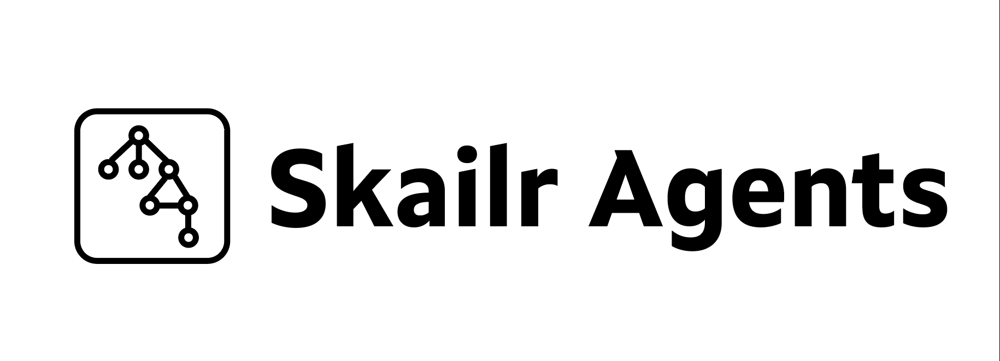

# skailr-agents

[License: MIT](LICENSE)
[Claude Code](https://docs.anthropic.com/en/docs/claude-code)
[Cursor](https://cursor.com/docs)
[Cursor Agent](https://github.com/cursoragent)



**A multi-agent operating model for Claude Code and Cursor.** Install it into a repo; Claude Code (or Cursor) runs the agents. Skailr adds org structure: plan before build, single-job roles, a visible message board, frozen contracts, and mechanical script gates.

You do not need prior knowledge of skailr. Pick a path below, install once, then run the slash commands in Claude Code.

| You want to… | Use | Commands |
| ------------ | --- | -------- |
| **Build a whole app / MVP / many parts / unclear scope** (gated) | Program tier | `/discover` → `/plan-program` → `/build-program` |
| **Build a whole app** as fast as possible (no gates) | Program YOLO | `/yolo-program` — [docs/YOLO.md](docs/YOLO.md) |
| Ship **one** cohesive feature (with approval gates) | Workstream | `/ship-feature` → `/continue-feature` → `/build-feature` |
| Ship **one** feature as fast as possible (no gates) | Feature YOLO | `/yolo` — [docs/YOLO.md](docs/YOLO.md) |
| Run **many** concurrent initiatives | Portfolio | `/discover-portfolio` → `/plan-portfolio` → `/status-portfolio` |

**Important:** `/ship-feature` and `/yolo` are **one feature, one story, one build**. They will **not** break a whole product into workstreams. For a greenfield app or multi-part initiative, use **`/discover`…`/build-program`** or **`/yolo-program`**.

---

## Quick start

### 0. What you need

- A project directory (empty git repo is fine; skailr does not scaffold your stack)
- [Claude Code](https://docs.anthropic.com/en/docs/claude-code) CLI (`claude` on your PATH), **or** [Cursor](https://cursor.com/docs)
- Node.js 18+ only if you want the mechanical gates (`scripts/skailr/*.mjs`) — optional for first runs

### 1. Create or open a project

```bash
mkdir my-app && cd my-app
git init
# optional: scaffold your stack (npm create, cargo init, etc.)
```

### 2. Install Claude Code (skip if you already have it)

```bash
curl -fsSL https://claude.ai/install.sh | bash
# or: npm install -g @anthropic-ai/claude-code
```

Log in on first run when prompted.

### 3. Install skailr-agents into the project

```bash
git clone https://github.com/ns-3e/skailr-agents.git /tmp/skailr-agents
/tmp/skailr-agents/install.sh "$(pwd)" --claude-only
```

Or from a local clone of this repo:

```bash
./install.sh /path/to/my-app --claude-only
```

Windows (PowerShell):

```powershell
git clone https://github.com/ns-3e/skailr-agents.git $env:TEMP\skailr-agents
& "$env:TEMP\skailr-agents\install.ps1" -TargetPath (Get-Location) -ClaudeOnly
```

Commit the pack so teammates get the same agents:

```bash
git add .claude scripts/skailr .gitignore
git commit -m "Add skailr-agents operating model"
```

Omit `--claude-only` to also install the Cursor mirror; use `--cursor-only` for Cursor alone. More: [Install details](#install-details).

### 4. Start Claude Code in the project

```bash
cd /path/to/my-app
claude
```

Slash commands from the pack are available (`/discover`, `/yolo-program`, `/ship-feature`, `/yolo`, …).

---

### Path A — Whole app / many parts / unclear scope (program tier)

Use this for a greenfield product, an MVP with several subsystems, or anything too big for one story.

#### Path A1 — Gated (recommended when product decisions matter)

**Step 1 — Discover (shared understanding)**

Paste the product vision:

```
/discover I want a billing SaaS: orgs, invoices, email reminders 3 days before due,
customer portal to pay, and an admin dashboard. Stack preference: TypeScript.
```

Claude runs discovery (program-architect). Answer clarifying questions until you confirm a shared brief written to `.claude/program/brief.md`.

**Do not skip confirmation.** Wrong assumptions here fan out across every workstream.

**Step 2 — Plan (decompose + freeze contracts)**

```
/plan-program
```

You get workstreams, a shared kernel, frozen interface contracts, and a dependency DAG in `.claude/program/`. Review and approve to **freeze** contracts. Downstream teams will build against those contracts (and stubs) in parallel.

**Step 3 — Build**

```
/build-program
```

Typical flow:

1. Foundation / shared kernel
2. Parallel workstream teams (each may run an internal feature-style pipeline)
3. Integration (real against real)
4. Program validation against the original brief
5. Release documentation

State lives under `.claude/program/` (`brief.md`, `plan.md`, `contracts/`, `ledger.md`, channels) so you can resume across sessions. Prefer a clean working tree before build.

**Resume later:** `/continue-program` when a session stopped mid-program.

#### Path A2 — YOLO (one shot, no approval gates)

Same end-to-end program pipeline, but brief/plan freezes and mid-build escalations are auto-decided:

```
/yolo-program Billing SaaS: orgs, invoices, email reminders 3 days before due,
customer portal to pay, admin dashboard. Prefer TypeScript.
```

Read the final **Assumptions made** and any orchestrator decisions carefully — those replace discovery/plan gates. Full notes: [docs/YOLO.md](docs/YOLO.md).

---

### Path B — One feature (gated)

Use when the ask is one cohesive change (e.g. “remind by email 3 days before due”) inside an existing or already-scaffolded app.

```
/ship-feature Users should get an email reminder 3 days before an invoice is due
```

What happens:

1. **Researcher** maps the repo (or notes greenfield).
2. **Story-writer** drafts acceptance criteria → you approve (or edit) the story.
3. Run `/continue-feature` after story approval → **architect** writes the tech spec.
4. Approve the spec, then:

```
/build-feature
```

Backend + frontend engineers run in parallel → E2E verification → adversarial validation → docs.

Artifacts: `.claude/tmp/` (`request.md`, `research.md`, `story.md`, `spec.md`, reports). Runtime state is gitignored.

**Next single features:** run `/ship-feature …` again. Stale tmp files are archived automatically.

---

### Path C — One feature, no gates (YOLO)

```
/yolo Users should get an email reminder 3 days before an invoice is due
```

Same pipeline as Path B, but story/spec approvals are skipped. Read the final **Assumptions made** section carefully. For a **whole app** one-shot, use Path A2 (`/yolo-program`) instead — `/yolo` will not decompose into workstreams. Full notes: [docs/YOLO.md](docs/YOLO.md).

---

### Path D — Many concurrent initiatives (portfolio)

```
/discover-portfolio <portfolio description>
/plan-portfolio
/status-portfolio
```

---

### After you finish

| Path | What to review |
| ---- | -------------- |
| Program (gated or YOLO) | Brief, plan, contracts, validator verdict, assumptions (YOLO), channel board under `.claude/program/` |
| Feature (gated or YOLO) | Validator verdict, `.claude/tmp/` reports, assumptions (YOLO) |

Then commit your app code as usual. Do **not** commit `.claude/tmp/` or most of `.claude/program/` runtime state (installer gitignore covers this).

---

## Mental model (zero prior knowledge)

skailr is **not** an agent framework (no LangGraph-style runtime). Claude Code / Cursor already run agents. This pack is the **operating model** on top:

1. **Plan first** — deconstruct before anyone builds.
2. **Specialize** — each agent has one job.
3. **Disclose just in time** — teams load only when routed.
4. **Coordinate in the open** — markdown channels, not private side chats.
5. **Freeze interfaces** — parallel teams build against contracts; changing a frozen contract normally needs your approval (YOLO program mode auto-decides and logs it).

Tiers nest: **portfolio** (many initiatives) → **program** (one large initiative) → **workstream** (one feature pipeline).

**Claude Code vs Cursor.** `.claude/` is the source of truth. `.cursor/` is a generated mirror. Edit `.claude/`, then `./scripts/remirror.sh` if you maintain this pack.

---

## Why this exists

Single agents are asked to plan, architect, build, test, and validate in one pass. Large projects still fail the way large human projects fail: unclear scope, overlapping ownership, silent interface drift, and coordination buried in one long chat.

If agents fail on large work, the model may not be the problem. **The operating model** might be.

---

## Five capabilities


| Capability | What it means |
| ---------- | ------------- |
| **Hierarchy** | Plan layer first; then teams execute. Program: `/discover` → `/plan-program` → `/build-program` (or `/yolo-program`). Feature: `/ship-feature` → `/build-feature` (or `/yolo`). |
| **Division of labor** | Single-job agents (research, story, architecture, engineers, verify, validate, document) plus domain teams (content, legal, PM, …). |
| **Progressive disclosure** | Thin registry → team lead → workers. Unused domains cost almost nothing. |
| **Message board** | Append-only channels under `.claude/program/channels/` (or `.claude/tmp/channels/` for a feature). |
| **Frozen contracts** | Cross-team seams freeze after plan approval; only the program-architect changes them after you approve blast radius. |


---

## Program tier (deep dive)

When a request is long, ambiguous, or too big for one team, the program tier runs first — like a VP overseeing simultaneous project teams.

### How conflict is designed out

- **Spatial (two teams, same file):** ownership must be disjoint; shared paths belong in the frozen kernel.
- **Temporal (Team B needs Team A's output):** contract-first. A freezes an interface; B builds against a stub in parallel; they integrate at the end.
- **Change control:** only the program-architect changes a frozen contract, and only after your approval.

### Program roles

| Agent | Writes code? | Purpose |
| ----- | ------------ | ------- |
| program-architect | No | Discovery; decomposition; owns all cross-team contracts |
| integration-verifier | Tests only | Proves independently-built workstreams compose |
| program-validator | No | Final sign-off against the original brief |
| program-documenter | Docs only | Changelog, API refs, runbooks from the diff |

Persistent state: `.claude/program/` (`brief.md`, `plan.md`, `contracts/`, `ledger.md`).

### Channels: the agent message board

Agents coordinate through an append-only board at `.claude/program/channels/` (`.claude/tmp/channels/` for a single feature). It is a **board, not a chat**: agents run to completion and cannot wait for a live reply.

- A blocked agent posts one typed message (`question`, `blocker`, `contract-change`, …), addresses `@agent` / `@team` / `@architect` / `@human`, and **ends its turn**.
- The orchestrator **routes**: scans `status: open`, dispatches the addressee, re-dispatches the blocked agent with the answer.
- `@human` and `contract-change` **halt** for you; unrelated workstreams keep running.

Full protocol: [PROTOCOL.md](.claude/program/channels/PROTOCOL.md). Seeded example: [program.md](.claude/program/channels/program.md).

### Documentation as a pipeline phase

`program-documenter` runs after validation. It documents the **diff**, not the plan; supports **create** and **reconcile** modes. Engineers can leave `DOC:` anchors.

---

## Domain teams and just-in-time disclosure

The program tier is domain-agnostic. Engineering is one team; content, legal, PM, design, marketing, and finance plug in as siblings.

**Built today:** engineering, **content**, **legal/compliance**, **PM/delivery**, plus portfolio agents. Design, marketing, and finance remain registry stubs (`status: not built`).

1. **Tier 1: registry** (`.claude/teams/registry.md`) — name, capability, `route-when`.
2. **Tier 2: team lead** — loaded only when a workstream routes there.
3. **Tier 3: workers + domain reference** — loaded as the lead dispatches them.

| Team | Owns | Verifier means |
| ---- | ---- | -------------- |
| engineering | files / directories | behavior proven by tests |
| content | pieces / sections | facts sourced + brand voice |
| legal | requirements / controls | every claim traced |
| pm | milestones / risks / digests | exceptions escalate |
| design | assets / artboards | a11y + design-system (stub) |
| marketing | channels / segments | message + measurement (stub) |
| finance | worksheets / models | numbers reconcile (stub) |

### Content / legal / PM (built)

- **Content:** `content-lead` → strategist → writer → editor. Never ship false claims or generic AI prose.
- **Legal:** `legal-lead` → analyst → compliance-reviewer → legal-validator. Skill: `trace-requirement`.
- **PM:** `pm-lead` → planner → risk-analyst → status-reporter. Skill: `compile-status-digest`.

To add a domain: create `.claude/agents/<prefix>/`, add a sharp `route-when` in the registry, set `status: built`.

---

## Workstream tier (feature pipeline)

One feature in → validated implementation out. Program workstreams may run this internally; you can also run it standalone via `/ship-feature`.

**Path:** researcher → story-writer → architect → backend + frontend (optional `data-engineer`) → e2e-verifier → validator → program-documenter.

| Agent | Writes code? | Scope | Purpose |
| ----- | ------------ | ----- | ------- |
| researcher | No | Read-only | Maps what exists |
| story-writer | Story doc | n/a | Testable acceptance criteria |
| architect | Spec doc | n/a | Data model, API, ownership split |
| backend-engineer | Yes | Backend globs | Migrations, services, handlers, unit tests |
| frontend-engineer | Yes | Frontend globs | UI, state, API client |
| data-engineer | Yes | Data globs | ETL/ELT, schemas (optional) |
| e2e-verifier | Tests only | Tests | User-perspective proof |
| validator | No | Read-only | Misses, skips, security gaps |

**Gates (gated path):** after story; after spec. Then unattended build. YOLO skips the human gates; script gates still run.

---

## Install details

The installer copies `.claude/` and `.cursor/` into your project, creates `.claude/tmp/` and `.claude/program/`, and appends ignore rules if missing. Idempotent; safe to re-run.

```bash
./install.sh /path/to/your-project
```

Manual (Claude Code only):

```bash
cp -r .claude /path/to/your-repo/
mkdir -p /path/to/your-repo/.claude/tmp /path/to/your-repo/.claude/program
```

Commit `.claude/agents/`, `.claude/commands/`, `.claude/teams/`, and tracked channel templates under `.claude/program/channels/`. Ignore runtime state under `.claude/tmp/` and most of `.claude/program/` (see `.gitignore`). Inventory: [manifest.json](manifest.json). License: [MIT](LICENSE).

### Enforcement fixtures (optional)

```bash
node scripts/skailr/check-ownership.mjs --map examples/parallel-api/ownership.json --map-only
node scripts/skailr/ledger-status.mjs --ledger examples/parallel-api/ledger.md
```

See `examples/parallel-api/` and [docs/intair-seam.md](docs/intair-seam.md).

---

## Tuning

- Swap `model:` in agent frontmatter. Researcher/story-writer often fine on Sonnet; architect, engineers, and validator benefit from Opus.
- Add repo-specific conventions to each agent's Standards section.
- If your repo does not split backend/frontend, redefine engineers along your real seam. The pattern is **disjoint ownership**, not the names.
- Back boundaries with CI that fails PRs whose backend commits touch frontend paths. Prompt scoping is a convention, not a hard sandbox.

---

## FAQ

### Is skailr-agents an agent framework?

No. Frameworks (LangGraph, CrewAI, AutoGen, …) provide a runtime. skailr is an **operating model**: roles, hierarchy, contracts, channels, script gates — Claude Code / Cursor remain the runtime.

### Can I build my entire initial app with `/ship-feature`?

No. `/ship-feature` and `/yolo` produce **one** story and **one** build. They do not create a multi-story backlog or loop features. Use **Path A1** (`/discover` → `/plan-program` → `/build-program`) or **Path A2** (`/yolo-program`) for a whole app or multi-part initiative.

### When should I use `/ship-feature` vs `/yolo` vs `/discover` vs `/yolo-program`?

- `/ship-feature` — one feature, keep story/spec approval gates.
- `/yolo` — one feature, skip human gates ([docs/YOLO.md](docs/YOLO.md)).
- `/discover` → `/plan-program` → `/build-program` — whole app, many parts, or unclear scope, with confirmation gates.
- `/yolo-program` — same program pipeline, skip discovery/plan freezes ([docs/YOLO.md](docs/YOLO.md)).
- `/discover-portfolio` — many concurrent initiatives.

### Do agents talk to each other directly?

Via markdown channels: an agent posts and ends its turn; the **orchestrator** routes to the addressee and re-dispatches with the answer. See [PROTOCOL.md](.claude/program/channels/PROTOCOL.md).

### What happens if a frozen contract is wrong?

The team posts `type: contract-change` to `@architect` and stops. The program-architect assesses blast radius; **you** approve before the contract updates. Teams never silently edit frozen interfaces.

### Can I add my own domain team (design, marketing, finance)?

Yes. Mirror the content-team shape under `.claude/agents/<prefix>/`, register a sharp `route-when` in [registry.md](.claude/teams/registry.md), set `status: built`.

### Does this work only for software engineering?

No. Engineering, content, legal, and PM are built; design/marketing/finance use the same pattern when you flip them to `built`.

---

## Contributing

See [CONTRIBUTING.md](CONTRIBUTING.md). Security reports: [SECURITY.md](SECURITY.md).

## Trademarks

Claude Code and Anthropic are trademarks of Anthropic, PBC. Cursor is a trademark of Anysphere, Inc. This project is not affiliated with, endorsed by, or sponsored by Anthropic or Anysphere.
